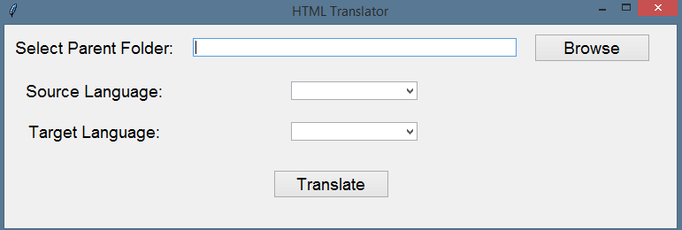

# HTML Translator

The HTML Translator script translates HTML files from one language to another using the Google Translate API via the `translatepy` module. It processes all HTML files in a directory and its subdirectories, translating text and placeholders.

## Features
- **Translate HTML Files:** Automatically translate text content and placeholders in HTML files.
- **Multithreading Support:** Utilizes multithreading to process multiple files concurrently, speeding up the translation process.
- **Customizable Languages:** Allows users to choose the target language from a list of available languages and specify the source language.
- **SSL Verification Bypass:** Handles SSL certificate verification issues to ensure smooth operation.

## Requirements
- Python 3.x
- `beautifulsoup4==4.12.2`
- `translatepy==2.3`
- `requests==2.31.0`
- `lxml==5.1.0`
- `chinese_converter==1.1.1`

## Installation
1. **Clone the repository:**
    ```sh
    git clone https://github.com/mofasuhu/html-translator.git
    ```

2. **Navigate to the project directory:**
    ```sh
    cd html-translator
    ```

3. **Install the dependencies:**
    ```sh
    pip install -r requirements.txt
    ```

## Usage
1. **Prepare your HTML files:**
   Ensure that all HTML files you want to translate are placed in the desired directory. The script will process all HTML files in this directory and its subdirectories.

2. **Run the script:**
    ```sh
    python translate_HTML.py
    ```

3. **Follow the GUI prompts:**



   - Select the parent folder containing the HTML files.
   - Choose the source language and target language from the dropdown menus.
   - Click the "Translate" button to start the translation process.

### Example
Here's an example of how to run the script and follow the GUI prompts:
```sh
python translate_HTML.py
```
You will see a GUI where you can:
- Select the parent folder containing the HTML files.
- Choose the source language and target language from the dropdown menus.
- Click the "Translate" button to start the translation process.

### Available Languages
- afrikaans
- albanian
- amharic
- arabic
- armenian
- azerbaijani
- basque
- belarusian
- bengali
- bosnian
- bulgarian
- catalan
- cebuano
- chinese (simplified)
- chinese (traditional)
- corsican
- croatian
- czech
- danish
- dutch
- english
- esperanto
- estonian
- filipino
- finnish
- french
- frisian
- galician
- georgian
- german
- greek
- gujarati
- haitian creole
- hausa
- hawaiian
- hebrew
- hindi
- hmong
- hungarian
- icelandic
- igbo
- indonesian
- irish
- italian
- japanese
- javanese
- kannada
- kazakh
- khmer
- korean
- kurdish
- kyrgyz
- lao
- latin
- latvian
- lithuanian
- luxembourgish
- macedonian
- malagasy
- malay
- malayalam
- maltese
- maori
- marathi
- mongolian
- myanmar
- nepali
- norwegian
- nyanja
- oriya
- pashto
- persian
- polish
- portuguese
- punjabi
- romanian
- russian
- samoan
- scots gaelic
- serbian
- sesotho
- shona
- sindhi
- sinhala
- slovak
- slovenian
- somali
- spanish
- sundanese
- swahili
- swedish
- tajik
- tamil
- telugu
- thai
- turkish
- ukrainian
- urdu
- uyghur
- uzbek
- vietnamese
- welsh
- xhosa
- yiddish
- yoruba
- zulu

## File Structure
- **translate_HTML.py:** The main script for translating HTML files.
- **ExampleFolderWithSubfolders.zip:** A zipped folder structure containing example HTML files for testing.
- **LICENSE:** The MIT license file for the project.
- **README.md:** This detailed readme file.
- **requirements.txt:** The dependencies required to run the script.
- **venv:** The virtual environment folder containing the installed dependencies.
- **screenshot.png:** A screenshot of the GUI.

## Contributing
If you have suggestions for improving this project, feel free to open an issue or create a pull request. Contributions are welcome!

## License
This project is licensed under the MIT License - see the LICENSE file for details.

## Contact
For any inquiries or issues, please contact the project owner at [mofasuhu@gmail.com](mailto:mofasuhu@gmail.com).
